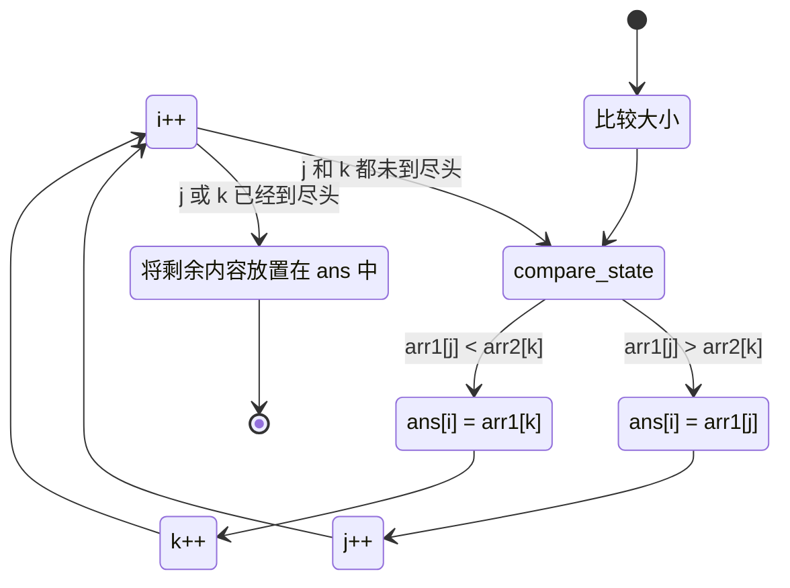

import Tabs from '@theme/Tabs';
import TabItem from '@theme/TabItem';

## 介绍

__归并排序__ _(Merge Sort)_，其中体现了 [分而治之](../programming-ideas/divide-and-rule.md) 的编程思想，
其时间复杂度为 $O(n\log_{}{n})$，
空间复杂度为 $O(n)$。

它与 [快速排序](quick-sort.md) 是有点类似的，但是又不完全是，见表：

|         | 归并排序             | 快速排序             |
|---------|------------------|------------------|
| 平均时间复杂度 | $O(n\log_{}{n})$ | $O(n\log_{}{n})$ |
| 空间复杂度   | $O(n)$           | $O(n\log_{}{n})$ |
| 最优时间复杂度 | $O(n\log_{}{n})$ | $O(n^{2})$       |
| 最坏时间复杂度 | $O(n\log_{}{n})$ | $O(n^{2})$       |
| 稳定性     | 稳定               | 不稳定              |

尽管快速排序的空间复杂度要更小，但是其稳定性都远远不如归并排序 _(尤其是处理大量数据时)_。

## 思路

### 合并

首先，假设我们有两个有序数组 `[1,3,5]` 与 `[2,4]`，
需要将其合并为有序数组，我们可以用到 [指针](../programming-ideas/pointer.md)。


### 比较

然后，我们使用指针对数组每个元素进行比较，小的就被放入了 `ans`。

### 主要流程

定义三个指针 `i`、`j`与`k`、三个数组为`arr1`、`arr2`、`ans`，运行流程如下：



## 代码实现

<Tabs>
  <TabItem value="cpp" label="C++" default>

```cpp showLineNumbers
/**
 * 合并排序实例程序。
 * @author CoolCLK
 */

#include <iostream>
#include <vector>
#include <string>

/**
 * 合并两个有序数组。
 * @author CoolCLK
 */
template<typename T>
std::vector<T> merge(std::vector<T> arr, std::vector<T> a, std::vector<T> b) {
    size_t i = 0, j = 0, k = 0;
    
    while (i < a.size() && j < b.size()) {
        if (a[i] < b[j]) {
            arr[k] = a[i];
            i++;
        } else {
            arr[k] = b[j];
            j++;
        }
        k++;
    }
    
    while (i < a.size()) {
        arr[k] = a[i];
        i++;
        k++;
    }
    
    while (j < b.size()) {
        arr[k] = b[j];
        j++;
        k++;
    }
}

/**
 * 对数组进行合并排序。
 * @author CoolCLK
 */
template<typename T>
void merge_sort(std::vector<T> arr) {
    if (arr.size() <= 1) {
        return arr;
    }
    size_t mid = arr.size() / 2;
    std::vector<T> left(arr.begin(), arr.begin() + mid);
    std::vector<T> right(arr.begin() + mid, arr.end());
    if (left.size() > 1) {
        left = merge_sort(left);
    }
    if (right.size() > 1) {
        right = merge_sort(right);
    }
    merge(arr, left, right);
}

/**
 * 主函数，可用于通用数组输入、输出 CLI 模板。
 * @author CoolCLK
 */
int main() {
    std::vector<int> array(0);

    std::cout << "[";
    while (true) {
        std::cout << "\e[s"; // 保存光标位置
        std::string input;
        std::cin >> input;
        std::cout << "\e[u"; // 恢复光标位置
        if (input == "]") {
            std::cout << "\e[1D" << "]" << " " << std::endl; // 往前移动消除原有输入
            break;
        }
        std::cout << input << ",";
        int num = std::stoi(input);
        array.emplace_back(num);
    }
    
    merge_sort(array);
    std::cout << "[";
    for (int el : array) {
        std::cout << el << ",";
    }
    std::cout << (array.size() > 0 ? "\e[1D" : "") << "]" << std::endl;
    
    return 0;
}
```

  </TabItem>
  <TabItem value="java" label="Java" default>

```java showLineNumbers
public class Main {
    static void merge(int[] arr,int[] left, int[] right) {
        int i = 0, j = 0,k = 0;
        while (i < left.length && j<right.length){
            if(left[i]< right[j]){
                arr[k]= left[i];
                i++;
            }
            else {
                arr[k]= right[j];
                j++;
            }
            k++;
        }
        while(i< left.length){
            arr[k]= left[i];
            i++;
            k++;
        }
        while(j< right.length){
            arr[k]= right[j];
            j++;
            k++;
        }
    }

    static void mergeSort(ArrayList<Integer> arr){
        if (arr.size() > 1) {
            int mid = arr.length / 2;
            int[] left = Arrays.copyOfRange(arr, 0, mid);
            int[] right = Arrays.copyOfRange(arr, mid, arr.length);
            mergeSort(left);
            mergeSort(right);
            merge(arr, left, right);
        }
    }

    public static void main(String[] args) {
        ArrayList<Integer> list = new ArrayList<>();
        Scanner scanner = new Scanner(System.in);

        System.out.print("["); // 输出起始括号

        while (true) {
            System.out.print("\u001b[s"); // 保存光标位置
            String input = scanner.next();
            System.out.print("\u001b[u"); // 恢复光标位置

            if ("]".equals(input)) {
                // 删除残留字符并结束输入
                System.out.print("\u001b[1D]\n"); // 左移光标
                break;
            }
            
            System.out.print(input + ",");
            list.add(Integer.parseInt(input));
        }

        mergeSort(list);

        System.out.print("[");
        for (int i = 0; i < list.size(); i++) {
            System.out.print(list.get(i) + (i < list.size() - 1 ? "," : ""));
        }
        System.out.println("]");
    }
}
```

  </TabItem>
</Tabs>
